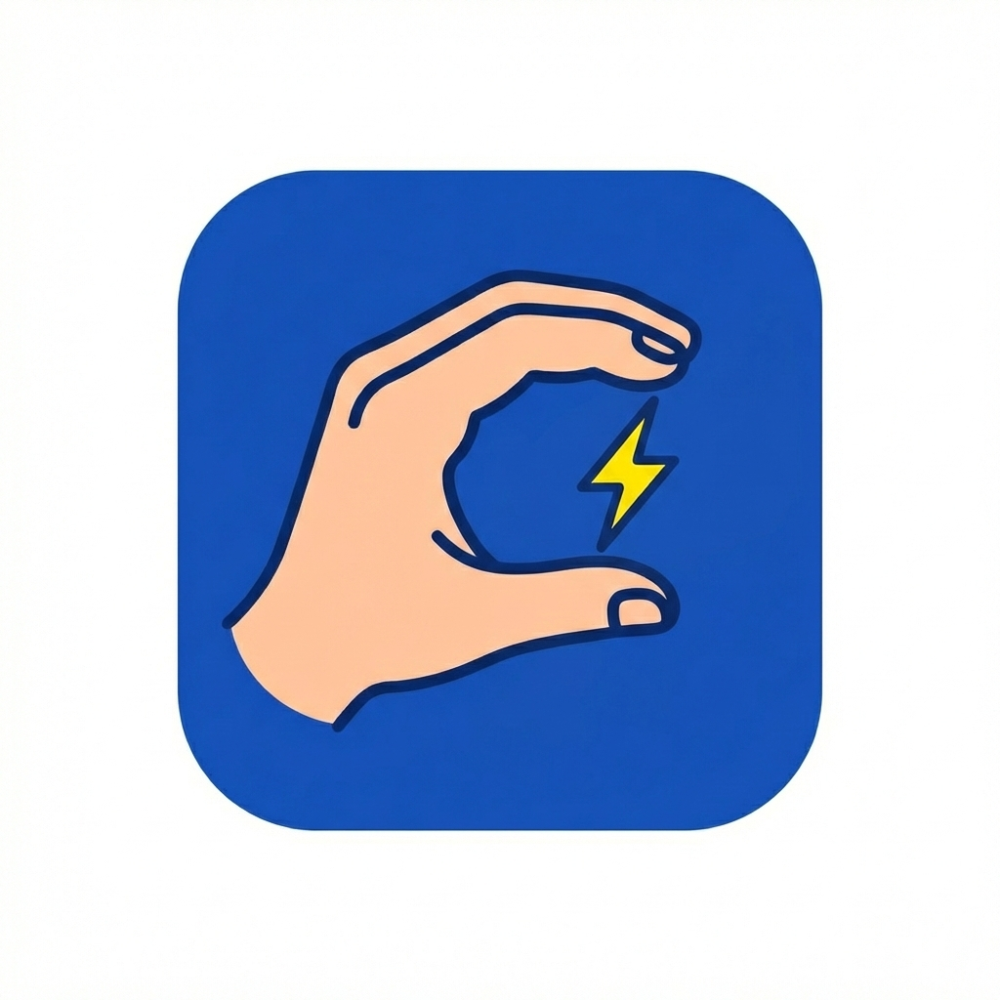

# ⚡ SignFlash
<a href="https://jbeskow.github.io/signflash/">
 jbeskow.github.io/signflash 
</a>

## Träna Svenskt Teckenspråk med flashcards!

🎬 titta på videon ✏️ skriv tecknet ✅ fortsätt tills du kan det!

❓ svarar du fel får du 4 alternativ

⭐⭐⭐ tre rätt i rad utan hjälp 🎉 tecknet är "klart"

📚 ordlistor i olika kategorier, med exempelfraser

🐢 olika uppspelningshastigeter (1x, 0.5x, 0.25x)

🆓 helt fritt och ingen inloggning, framsteg sparas i browsern

🎥 videor från [Teckenspråkslexikon](https://teckensprakslexikon.su.se), Stockholms universitet.

💡 tips! på mobiltelefon, välj spara på hemskärmen så funkar det som webapp (utan adressfält)

💚 Vibekodat med kärlek av [jbeskow](https://github.com/jbeskow)
