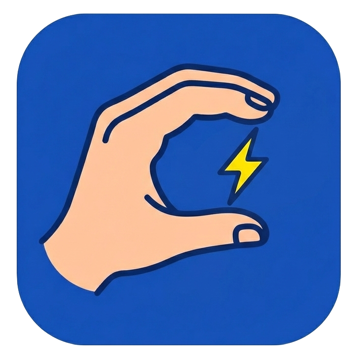

# ⚡ SignFlash
<a href="https://jbeskow.github.io/signflash/">
 jbeskow.github.io/signflash 
</a>

## Träna Svenskt Teckenspråk med flashcards!

🎬 titta på videon ✏️ skriv tecknet ✅ fortsätt tills du kan det!

❓ svarar du fel får du alternativ

⭐⭐⭐ tre rätt i rad utan hjälp - tecknet är "klart" 🎉

📚 ordlistor i olika kategorier, med exempelfraser

🐢 olika uppspelningshastigeter (1x, 0.5x, 0.25x)

🆓 helt fritt. ingen inloggning. framsteg sparas i browsern

🎥 videor från [Teckenspråkslexikon](https://teckensprakslexikon.su.se), Stockholms universitet.

💡 tips! på mobiltelefon, välj *lägg till på hemskärmen* så körs sidan som en webapp (utan adressfält)

💚 vibekodat med kärlek av [jbeskow](https://github.com/jbeskow)
